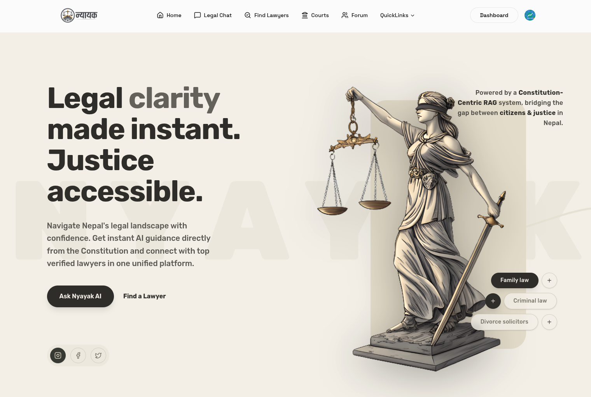
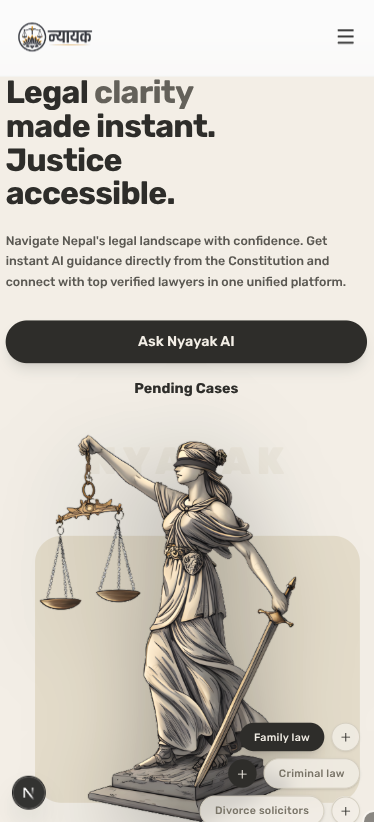
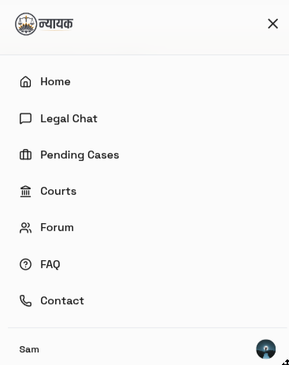
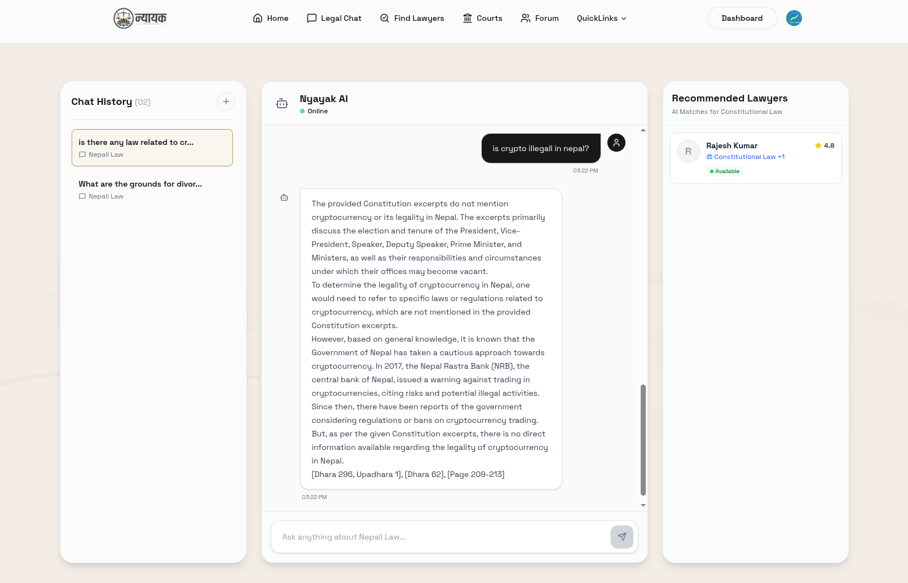
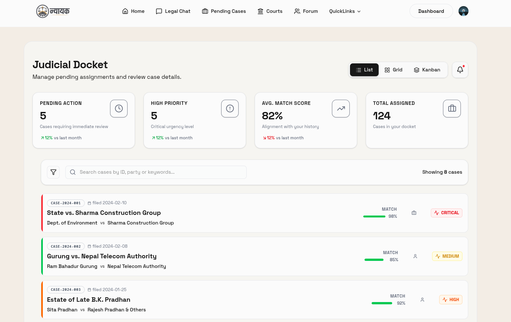
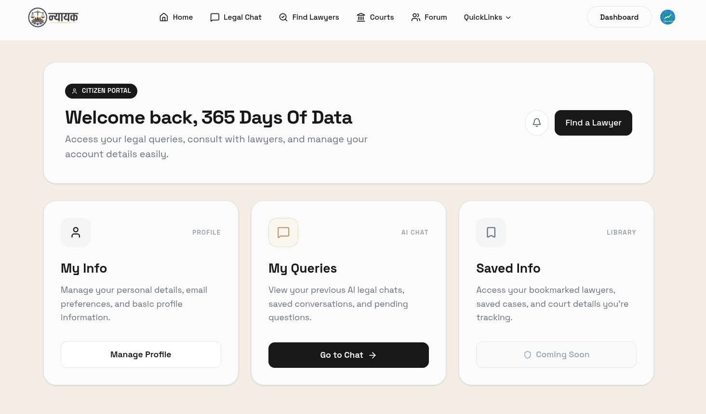
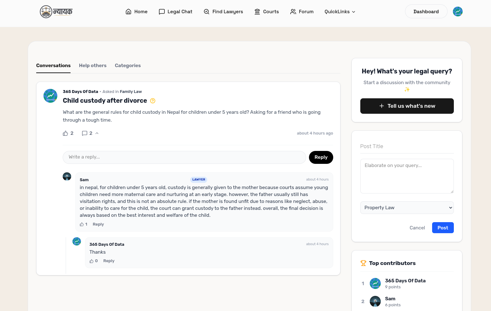
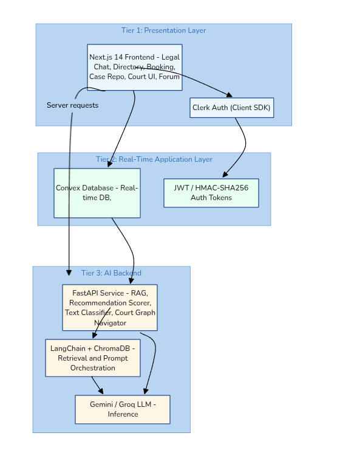
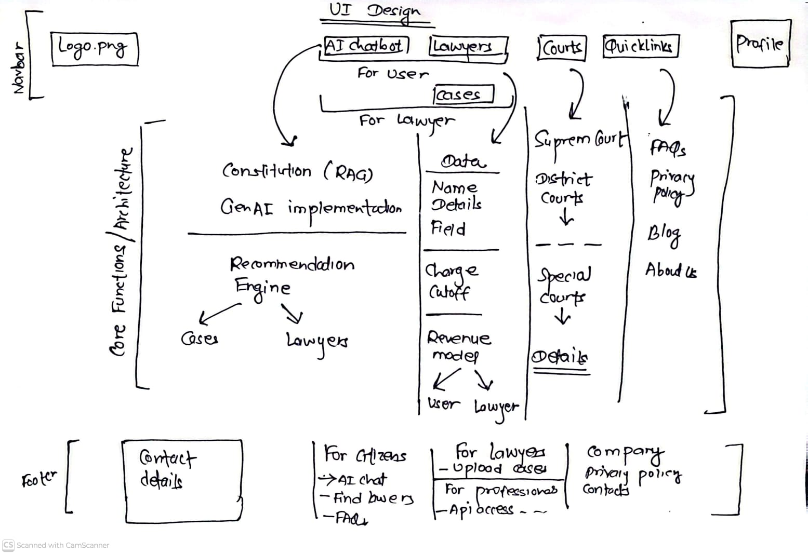
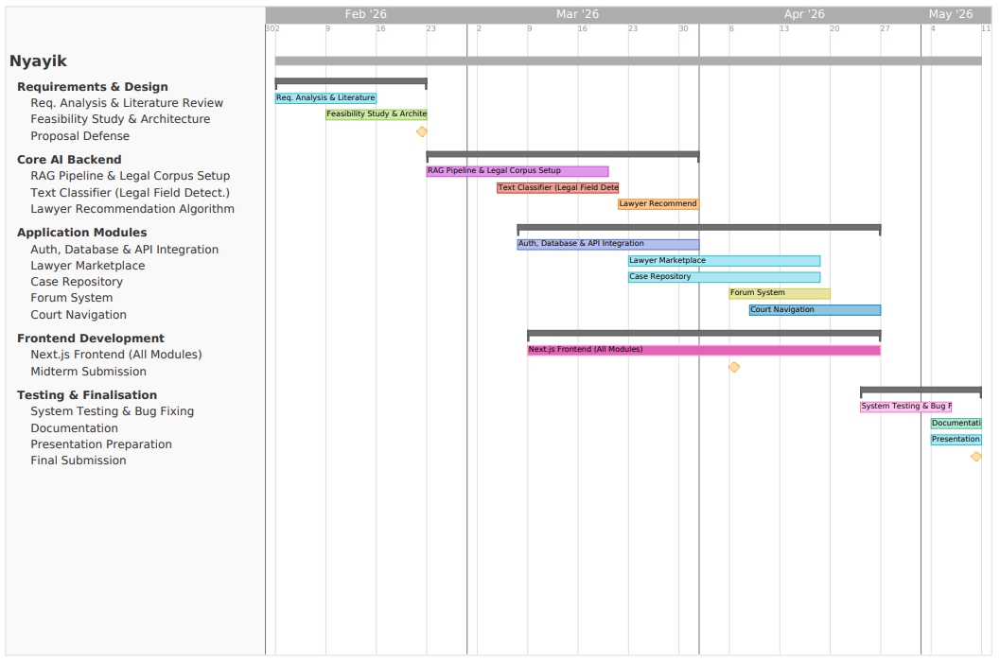

  
  <h1>Nyayak: digital legal navigation system designed for Nepal</h1>
  
<i>Bridging the gap between citizens and justice </i>

---
The idea is simple: legal help in Nepal should feel searchable, understandable, and actually useful. If you want to jump around, start with [visuals](#visual), skim [what the product does](#what-it-does), or go straight to [the algorithms](#the-algorithms-under-the-hood).

---

## What It Does
Nyayak tries to solve three problems at once.

Citizens need quick answers without legal jargon, so the [AI chat](#ai-assistant-and-legal-answers) gives citation-backed guidance from Nepali law (constitution 2072). Lawyers need visibility, so the [lawyer marketplace](#lawyer-marketplace-and-case-management) helps people discover specialists who match the case. And because Nepal's legal system is spread across districts, the [court navigator](#court-navigation-and-jurisdiction-discovery) makes jurisdiction and location feel less opaque.

There is also a [community layer](#community-forum-and-peer-knowledge): people can ask questions, reply, and surface useful contributors through a graph-based forum. The whole thing sits on a four-tier stack with Next.js, Convex, Clerk, and a Python AI backend.

---

## Visual

If you want the deep dive version on how this all works, jump to [The Algorithms Under the Hood](#the-algorithms-under-the-hood).

*(See [Project Timeline](images/gantt.png) for the proposed 14-week build schedule.)*

### Landing and mobile experience

  <figure style="display:inline-block; margin:0 12px 18px 0; vertical-align:top; width:420px; max-width:100%;">
    
    <figcaption><em>Desktop landing page.</em></figcaption>
  </figure>

  <figure style="display:inline-block; margin:0 10px 18px 10px; vertical-align:top; width:160px; max-width:100%;">
    
    <figcaption><em>Mobile homepage.</em></figcaption>
  </figure>
  <figure style="display:inline-block; margin:0 10px 18px 10px; vertical-align:top; width:240px; max-width:100%;">
    
    <figcaption><em>Mobile navbar</em></figcaption>
  </figure>

  <figure style="display:inline-block; margin:0 12px 18px 12px; vertical-align:top; width:500px; max-width:100%;">
    
    <figcaption><em>Footer section</em></figcaption>
  </figure>

### AI assistant and legal answers
**Citizens ask questions in plain English.** Instead of relying on generic LLM hallucinations, results are grounded to the *Constitution of Nepal* and the *Civil Code*.

  <figure style="display:inline-block; margin:0 12px 18px 12px; vertical-align:top; width:400px; max-width:100%;">
    
    <figcaption><em>Chatbot UI: conversational entry point for legal questions along with lawyer recommendation system.</em></figcaption>
  </figure>

The assistant is built around the **hybrid RAG flow** described in the proposal. It pulls legal chunks, grounds the response with citations, and then keeps the conversation history saved so people can return later. This isn't generic-every answer traces back to Nepali law.

### Lawyer marketplace and case management
**Lawyers showcase their expertise while citizens find matches tailored to their case details.** The marketplace is not just a directory-it's a *matching system* where query, specialization tags, availability, and profile relevance all matter. On the lawyer side, they get a docket view to track pending cases and manage consultations in real-time.

  <figure style="display:inline-block; margin:0 8px 18px 8px; vertical-align:top; width:380px; max-width:48%;">
    
    <figcaption><em>Find lawyer section: AI-assisted discovery and specialization filters.</em></figcaption>
  </figure>
  <figure style="display:inline-block; margin:0 8px 18px 8px; vertical-align:top; width:380px; max-width:48%;">
    
    <figcaption><em>Pending cases: lawyer-side docket view for active matters.</em></figcaption>
  </figure>

Why does this matter? The proposal treats lawyer recommendation as part of the same pipeline as legal assistance. A citizen's query doesn't just fetch legal chunks-it also finds the right lawyer. Specialization tags, term frequency from their bio, availability status, and case relevance all feed into a content-based scoring model that surfaces the best matches first.

### Citizen and lawyer dashboards
Both parties get personalized control panels tailored to their workflows.

  <figure style="display:inline-block; margin:0 8px 18px 8px; vertical-align:top; width:400px; max-width:48%;">
    
    <figcaption><em>Citizen dashboard: legal queries, saved info, and personal account actions.</em></figcaption>
  </figure>
  <figure style="display:inline-block; margin:0 8px 18px 8px; vertical-align:top; width:400px; max-width:48%;">
    
    <figcaption><em>Lawyer dashboard: practice overview, consultations, and case tracking.</em></figcaption>
  </figure>

### Community forum and peer knowledge
**A peer-sourced legal knowledge space where interactions automatically elevate the best advice.** Top contributors are surfaced naturally based on interaction graphs, not random ordering.

  <figure style="display:inline-block; margin:0 12px 18px 12px; vertical-align:top; width:560px; max-width:100%;">
    
    <figcaption><em>Community forum: nested discussions, replies, and contributor ranking.</em></figcaption>
  </figure>

Forum discussion is intentionally *more social than static*. Replies, upvotes, and nested threads all feed into a PageRank-style ranking model that makes meaningful contributor signals bubble up. When you're reading a thread, you see the most influential responses first-not chronologically, but by actual impact.

### Court navigation and jurisdiction discovery
**Unsure where to file a case?** We mapped Nepal's 77 districts into an intelligent navigation graph determining jurisdiction and geographic distance. The user is not just seeing pins-they're getting a path to the right court.

  <figure style="display:inline-block; margin:0 12px 18px 12px; vertical-align:top; width:500px; max-width:100%;">
    
    <figcaption><em>Court navigator: district-level court discovery and route support.</em></figcaption>
  </figure>

### System architecture and product planning
**Built on a robust, free-tier optimized stack** to ensure $O(\log n)$ database reads and secure operations.

  <figure style="display:inline-block; margin:0 8px 18px 8px; vertical-align:top; width:480px; max-width:48%;">
    
    <figcaption><em>System architecture: presentation, real-time, and AI layers working together.</em></figcaption>
  </figure>
  <figure style="display:inline-block; margin:0 8px 18px 8px; vertical-align:top; width:480px; max-width:48%;">
    
    <figcaption><em>System sketch: early product thinking and module planning on paper.</em></figcaption>
  </figure>

- **Presentation Layer**: Next.js 14, Tailwind CSS, Clerk Auth
- **Real-Time Data Layer**: Convex DB (reactive connections, zero polling)
- **AI / Inference Backend**: Python, FastAPI, LangChain, ChromaDB, Google Gemini / Groq.

The hand-drawn system design sketch and the architecture diagram tell the same story from two angles: product thinking first, then implementation. Real-world constraints matter-so we build to scale efficiently on free tiers. 

  <figure style="display:inline-block; margin:0 12px 18px 12px; vertical-align:top; width:640px; max-width:100%;">
    
    <figcaption><em>Project Gantt chart: the proposed 14-week build timeline.</em></figcaption>
  </figure>

---

## The Algorithms Under the Hood

Nyayak goes beyond simple API calls by integrating core information retrieval and graph theory algorithms. 

### 1. AI Legal Assistance & Lawyer Matching

**Part A - Hybrid Retrieval (RAG)**
Queries run against ChromaDB using a weighted retrieval score:
$$ \text{Score}_{Final}(d, Q) = 0.70 \times \text{Score}_{BM25}(d, Q) + 0.30 \times \text{Score}_{Cosine}(d, Q) $$
*Why?* BM25 ensures exact keyword precision for legal clauses (70%), while Cosine similarity captures semantic intent (30%). Top-3 chunks are injected as grounding context for the LLM.

**Part B - Content-Based Lawyer Recommendation**
User query $Q$ is tokenized into term set $T_{Q}$. Every lawyer profile $L$ is scored:
$$ \text{Score}(L, Q) = \alpha\, CM(L) + \beta\, TF(L) + \gamma\, AB(L) $$
*(Where CM = Category Match [+20pts], TF = Bio Term Frequency [+2pts/term], AB = Availability Bonus [+10pts]). Results are returned with explicit match reasoning. This is the logic you see in action when the [Find Lawyer](#lawyer-marketplace-and-case-management) interface surfaces candidates.*

### 2. Graph-Based Forum & Court Navigation

**Part A - Forum Reputation (PageRank) & DFS Threading**
Users are graph nodes. Replies ($w=2$) and Upvotes ($w=3$) are directed edges. 
Influence $PR(u)$ is calculated to surface Top Contributors. When fetching threads, a **Depth-First Search (DFS)** traverses the comment graph to chronologically rebuild nested reply trees.

**Part B - Court Routing (Dijkstra's Path)**
Courts across 77 districts form a weighted graph $G=(C, E)$. Edge weights are calculated as $w(c_i, c_j) = d_{geo} \times p_{juris}$ (factoring geographic distance with a cross-jurisdiction penalty). **Dijkstra's Shortest Path** evaluates $O((|C| + |E|) \log |C|)$ to immediately locate the authorized jurisdictional court for the citizen. This is what powers the [Court Navigator](#court-navigation-and-jurisdiction-discovery)-not random pins, but actual optimal routing.

### 3. Database Indexing and Security
- **Performance**: Convex composite indexes (e.g., `by_userId`) drop lookups from $O(n)$ to $O(\log n)$.
- **Security**: Authentication uses **HMAC-SHA256 signature verification** on Clerk webhooks to prevent forged event injections, relying on strictly established **JWT bearer tokens** (RFC 7519).

---

*To be submitted as a FYP (CSIT)*

